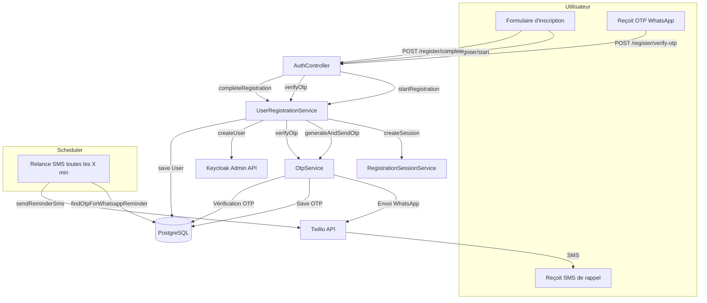

# TestOTP – Inscription sécurisée avec OTP WhatsApp/SMS et Keycloak

## Présentation

TestOTP est une application backend Java/Spring Boot permettant l'inscription d'utilisateurs avec vérification OTP (One-Time Password) envoyée via WhatsApp (Twilio Sandbox), puis relance automatique par SMS si l'utilisateur ne vérifie pas le code dans un délai configurable. L'application s'intègre à Keycloak pour la gestion des utilisateurs et utilise PostgreSQL pour la persistance.

---

## Fonctionnalités principales
- Inscription utilisateur avec vérification OTP (WhatsApp puis SMS)
- Intégration Keycloak (création utilisateur, SSO)
- Gestion des sessions d'inscription et des OTP
- Relance automatique par SMS après X minutes si l'OTP WhatsApp n'est pas vérifié
- Nettoyage automatique des OTP et sessions expirés
- API REST documentée (OpenAPI/Swagger)
- Sécurité stateless (Spring Security)

## Envoi du code de vérification OTP via Twilio

Lors de l'inscription, l'application génère un code OTP (One-Time Password) unique pour l'utilisateur. Ce code est envoyé en priorité via WhatsApp en utilisant l'API Twilio Sandbox.  
Si l'utilisateur ne vérifie pas ce code dans un délai configurable (par défaut 5 minutes), une relance automatique est effectuée : le même code OTP est alors envoyé par SMS, toujours via Twilio, pour maximiser les chances que l'utilisateur reçoive et valide son code.

**Détails techniques :**
- L'envoi WhatsApp et SMS utilise l'API Twilio (Twilio REST API).
- Le numéro WhatsApp utilisé est celui du Sandbox Twilio : `+14155238886`.
- Le numéro SMS utilisé est celui configuré dans Twilio.
- Le code OTP n'est jamais régénéré entre WhatsApp et SMS : l'utilisateur reçoit le même code sur les deux canaux.
- L'envoi du SMS de rappel est entièrement automatisé grâce à une tâche planifiée (scheduler) dans l'application.

**Flux résumé :**
1. L'utilisateur s'inscrit → reçoit un OTP sur WhatsApp via Twilio.
2. Si non vérifié après X minutes → reçoit un SMS de rappel avec le même OTP via Twilio.
3. L'utilisateur peut valider le code reçu sur WhatsApp ou par SMS.

> **Envoi du code OTP via Twilio**
>
> Lors de l'inscription, un code de vérification (OTP) est généré et envoyé à l'utilisateur via WhatsApp grâce à l'API Twilio. Si l'utilisateur ne valide pas ce code dans un délai de X minutes, le même code lui est automatiquement renvoyé par SMS, toujours via Twilio. Cette double notification maximise la délivrabilité et la sécurité du processus d'inscription.

---

## Architecture technique

- **Spring Boot** : Framework principal
- **Spring Security** : Sécurité des endpoints
- **Keycloak** : Gestion des utilisateurs et authentification
- **Twilio** : Envoi OTP via WhatsApp et SMS
- **PostgreSQL** : Base de données
- **Scheduler** : Tâches planifiées (relance, nettoyage)
- **OpenAPI/Swagger** : Documentation API

### Schéma d'architecture


---

## Principaux flux métier

### 1. Inscription utilisateur
- **POST /api/auth/register/start** : Démarre l'inscription, envoie un OTP via WhatsApp
- **Scheduler** : Si l'OTP n'est pas vérifié sous X minutes, envoie un SMS de rappel automatiquement
- **POST /api/auth/register/verify-otp** : Vérifie le code OTP (WhatsApp ou SMS)
- **POST /api/auth/register/complete** : Finalise l'inscription (mot de passe, création Keycloak)

### 2. Nettoyage automatique
- Suppression périodique des OTP et sessions expirés

---

## Structure du projet

- `config/` : Configuration Spring, Keycloak, Twilio, OpenAPI, Mapper
- `controller/` : Points d'entrée REST (inscription, santé)
- `dto/` : Objets de transfert pour les requêtes/réponses API
- `entity/` : Modèles JPA (User, OtpCode, RegistrationSession)
- `exception/` : Exceptions métier et gestion globale des erreurs
- `mapper/` : Conversion entité <-> DTO (ModelMapper)
- `repository/` : Accès aux données (JPA Repository)
- `scheduler/` : Tâches planifiées (nettoyage, relance OTP)
- `service/` : Logique métier (inscription, OTP, Keycloak, session)

---

## Configuration

Exemple de `src/main/resources/application.properties` :
```properties
# Base de données
spring.datasource.url=jdbc:postgresql://localhost:5432/keycloak_otp_db
spring.datasource.username=postgres
spring.datasource.password=motdepasse

# Keycloak
keycloak.realm=otp-realm
keycloak.resource=otp-registration-client
keycloak.auth-server-url=http://localhost:8080
keycloak.credentials.secret=your-client-secret
keycloak.admin.server-url=http://localhost:8080
keycloak.admin.realm=master
keycloak.admin.username=admin
keycloak.admin.password=admin
keycloak.admin.client-id=admin-cli

# Twilio
twilio.account.sid=...votre SID...
twilio.auth.token=...votre TOKEN...
twilio.phone.number=+18454392459
twilio.whatsapp.sandbox.number=+14155238886

# OTP
otp.expiration.minutes=50
otp.length=6
otp.sms.reminder.delay.minutes=5

# Port serveur
server.port=8081
```

---

## Lancement du projet

1. **Configurer la base PostgreSQL et Keycloak** (voir docker-compose.yml si besoin)
2. **Configurer Twilio Sandbox** (WhatsApp et SMS)
3. **Adapter le fichier `application.properties`**
4. **Lancer l'application**
   ```bash
   ./mvnw spring-boot:run
   ```
5. **Accéder à la documentation API**
   - Swagger UI : http://localhost:8081/swagger-ui.html

---

## Tests et supervision
- Les logs `[DIAG]` permettent de suivre le scheduler et la relance SMS.
- Pour tester la relance rapidement, mettre `otp.sms.reminder.delay.minutes=1`.
- Vérifier les OTP en attente de relance en base :
  ```sql
  SELECT * FROM otp_codes WHERE used = false AND expires_at > NOW() AND whatsapp_sent_at IS NOT NULL AND whatsapp_sent_at <= NOW() - INTERVAL '5 minutes' AND sms_reminder_sent_at IS NULL;
  ```

---

## Contributions & évolutions
- Personnalisation des messages WhatsApp/SMS
- Ajout d'un endpoint d'admin pour supervision
- Internationalisation (i18n)
- Tests unitaires et d'intégration

---

## Auteurs
- Projet développé par [ton équipe/ton nom] 